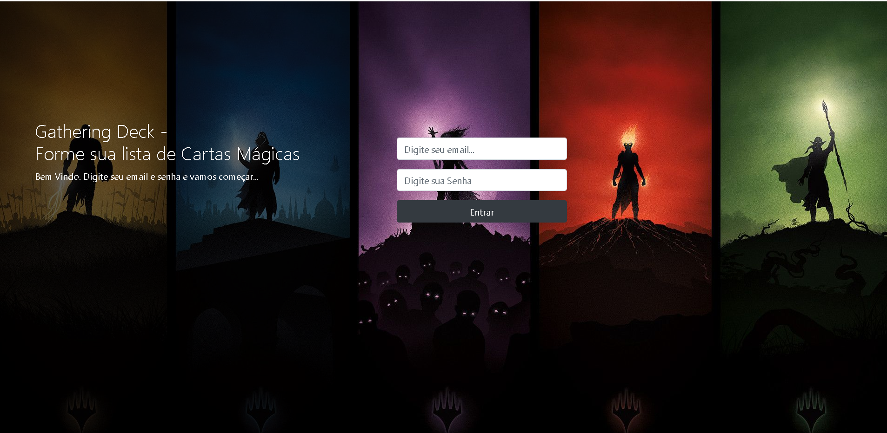
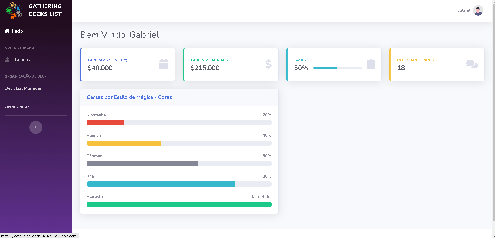
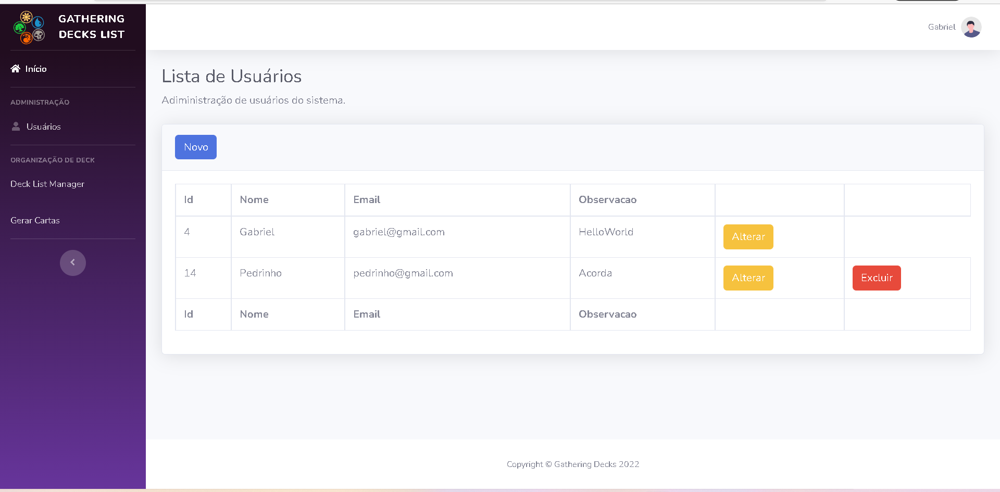
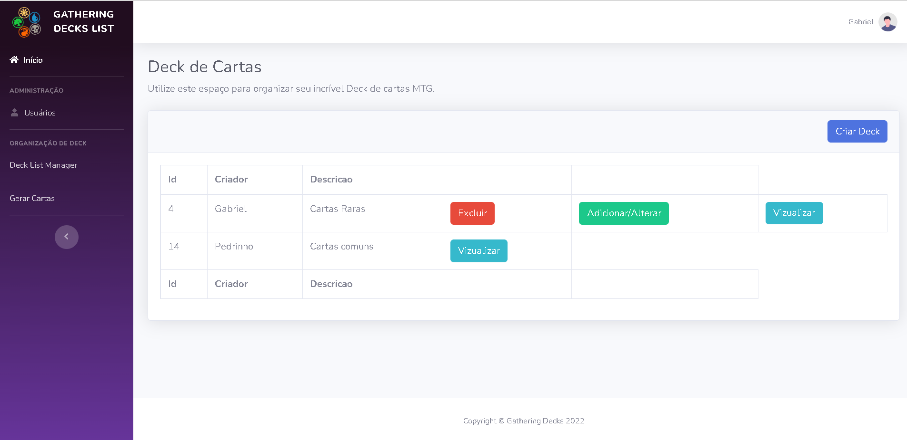
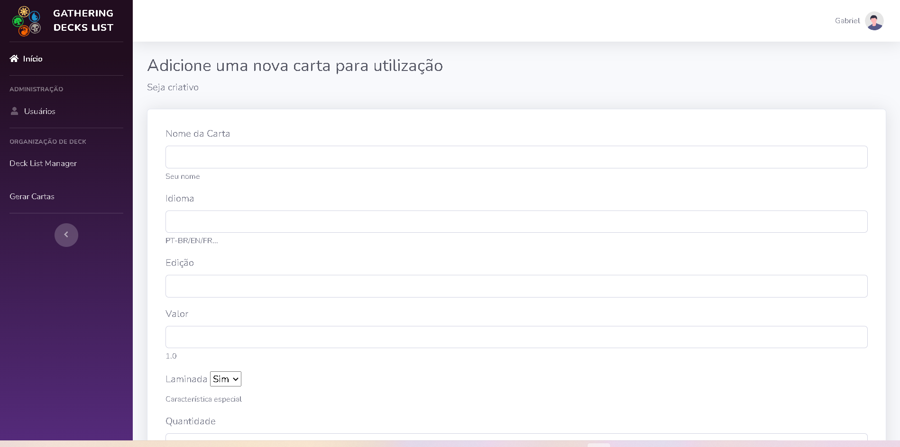

# gathering-decks-list
> Um jeito simples de manter seu Deck de cartas organizado

<h3 align="center">
    
    
   
</h3>

  </a>
   <a href="https://github.com/gabrielbcsilva">
   
 

  </a>

  
 
  

## Gathering Deck List - Organize Seu Deck!

- [Sobre](#sobre)
- [Tecnologias utilizadas](#tecnologias-utilizadas)
- [Passo a Passo](#passo-a-passo)
- [Como contribuir](#como-contribuir)

## :interrobang: Sobre

Um _App_ que visa auxiliar jogadores do tão famoso Magic the Gathering a organizar seu Deck de cartas! Você poderá logar-se ver o deck de outros amigos e editar o seu, além de cadastrar novas cartas.
[Acesse Aqui](https://gathering-deck-java.herokuapp.com/login)

## :diamonds: Tecnologias utilizadas

O projeto foi desenvolvido utilizando as seguintes tecnologias:

- [Java](https://www.java.com/)
- [SpringBoot](https://spring.io/projects/spring-boot)
- [Thymeleaf](https://www.thymeleaf.org/)

## - Passo a Passo

Clone este projeto ou baixe um novo projeto no site da Spring boot com JPA instalado.

     1. Configure sua classe de Banco de dados o código fica em application.properties

     2. Execute o comando .\mvnw spring-boot:run -e no terminal no caso do Windows
     
     3. Se não obtiver erros é só acessar localhost:8080!
     
     4. Crie um usuário na tabela gerada tb_usumtg
     
     5. O projeto do backend está separado e o link da documentação é esse https://documenter.getpostman.com/view/21229006/Uz5GobTk
     
     6. Há muitos detalhes a serem melhorados caso deseje contribuir é só realizar um fork do projeto, ajudará bastante.

     

**Tela 1**: Login.

Essa é a tela inicial:

**Tela 2**: Home

 Essa tela de home está estática, mas é uma ideia de implementação

 
 
**Tela 3**: Usuários

 Tela de usuários, você não poderá excluir seu usuário. Apenas outros.

**Tela 4**: Decks
 Tela de Decks, crie quantos quiser. Você só poderá editar o seu. Ficará disponível apenas a vizualiação de decks de amigos

**Tela 5**: Nova Carta para mandar para API
Não foi implementado mensagem de sucesso, porém poderá ser verificado na montagem do deck essa nova carta. Essa tela envia direto para API externa também hospedada na Heroku

## :dart: Como contribuir

- Faça um _Fork_ deste repositório;
- Crie uma _branch_ com a sua feature: `git checkout -b my-feature`
- _Commit_ suas mudanças: `git commit -m 'feat: My new feature'`
- Faça um _push_ da sua branch: `git push origin my-feature`
